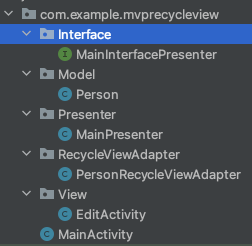
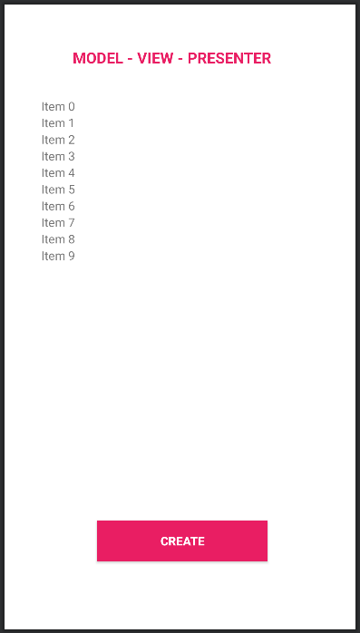

<h1 align="center">Model - View - Presenter in Android 
    This is a simple project built on MVP architectural pattern
</h1>

    

# [**Table Of Content**](#table-of-content)
- [**Table Of Content**](#table-of-content)
- [**Introduction**](#introduction)
- [**What is Model-View-Presenter ?**](#what-is-model-view-presenter-)
- [**Directory Structure**](#directory-structure)
- [**Step-by-Step Implementation**](#step-by-step-implementation)
  - [**Step 1: Create a new project**](#step-1-create-a-new-project)
  - [**Step 2: Create model class**](#step-2-create-model-class)
  - [**Step 3: Woking with main_activity.xml**](#step-3-woking-with-main_activityxml)
  - [**Step 4: Working with Interface**](#step-4-working-with-interface)
  - [**Step 5: Defining Presenter**](#step-5-defining-presenter)
- [**Demo**](#demo)
- [**Advantages & Disadvantage**](#advantages--disadvantage)
- [**My Mentors**](#my-mentors)
- [**Made with 💘 and Android **](#made-with--and-android-)

# [**Introduction**](#introduction)

First of all, we have to answer a crucial question whenever go in search of anything

What is design pattern ?

Design pattern is a general repeatable solution to a commonly occurring problem in software design. Design pattern is not a template or a structure that we have to abide by. However, we couldn't transform directly into code. It is a description or template for how to solve a problem that can be used in many different situations.

There are 3 renewed design pattern when it comes to develop Android programs. They are

- [**MVVM**](https://github.com/Phong-Kaster/GeoComply-MVVM-Architecture-in-Android)

- **MVP**(*current*)

- [**MVC**](https://github.com/Phong-Kaster/GeoComply-MVC-Architecture-in-Android)

It is document I will describe every thing you need to know & understand to take advance of MVP architecture into a Android application.

# [**What is Model-View-Presenter ?**](#what-is-model-view-presenter)

In the initial stages of Android development, programmer do write codes in such a manner that eventually creates a MainActivity class which contains all the implementation logic(real-world business logic) of the application. This approach of app development leads to Android activity gets closely link both UI and the application data processing mechanism. Further, it causes difficulties in the maintenance and scaling of such mobile applications. 

To avoid such problems in maintainability, readability, scalability, and refactoring of applications, developers prefer to define well-separated layers of code. 

By applying software architecture patterns, one can organize the code of the application to separate the concerns. MVP (Model — View — Presenter) architecture is one of the most popular architecture patterns and is valid in organizing the project.

    

<h3 align="center">

***Model-View-Presenter Architectural Pattern***
</h3>

A standard MVP pattern have 3 layers are:

**MODEL** - In an application with a good layered architecture, this model would only be the gateway to the domain layer or business logic. See it as the provider of the data we want to display in the view. Model’s responsibilities include using APIs, caching data, managing databases and so on.

**VIEW** - The purpose of this layer is to inform the PRESENTER about the user’s action & define how data will be showed in a XML layout. Presenter returns result and View show end-user consequence basing on what Interface's method is called. Interface's method is override in Activity.

**PRESNTER** - The Presenter is responsible to act as the middle man between View and Model. It retrieves data from the Model and returns it formatted to the View. But unlike the typical MVC, it also decides what happens when you interact with the View

# [**Directory Structure**](#directory-structure)

    

<h3 align="center">

***Directory Structure***
</h3>

- **Interface** - It consists interface which define all methods in order to Presenter communicates with View(Activity).

-  **Model** - Where developers describe what attributes that a Table has in database.

- **Presenter** - The core component of MVP architecture. Which make difference with others. The presenter act as a middle-man between Model and View. It handles all logical features & decide what happens when end-user interact with View.

- **RecycleViewAdapter** - The project use `RecycleView` to create a list of item which is the component end-users interact all the time. From this list, an item could be modify by anyway they want.

- **View** - All screens including MainActivity that users interact. It also shows formatted data to who is watching them.

# [**Step-by-Step Implementation**](#step-by-step-implementation)

## [**Step 1: Create a new project**](#step-1-create-a-new-project)

Open Android Studio in your PC/Laptop.

Click on File, then New => New Project.

Choose Empty activity

Select language as Java.

Select the minimum SDK as per your need. I chosen Android 7, for instance.

## [**Step 2: Create model class**](#step-2-create-model-class)

    public class Person {
        private String name;
        private String phone;

        #Constructor..

        #Getter & setter..
    }

Class Person is in charge of ensuring correct format with new person added to database. For instance, a person object only have 2 properties include: name, phone. Therefore, we are unable to add a incorrect person object have 4 or more properties. 

In other word, we are eligible for changing name & phone of a Person object only.

## [**Step 3: Woking with main_activity.xml**](#step-3-woking-with-main_activityxml)

Right now, open activity_main.xml

We have to design to make sure that a recycle view put on MainActivity. The recycleView will generate a list of people with their name & phone. 

End-users are able to click on element to modify or eradicate them.

    

<h3 align="center">

***MainActivity maybe look like above***
</h3>

## [**Step 4: Working with Interface**](#step-4-working-with-interface)

To establish communication between View-Presenter and Presenter-Model, an interface is needed. This interface class will contain all abstract methods which will be defined later in the View, Model, and Presenter class.

Interface is the way Presenter need to use to get in touch with View. Every action is passed to presenter. It will handle before determining what happens continually. 

    public interface MainInterfacePresenter {

        interface PresenterView{
            void createSuccessfully();
            void createFailed();

            void modifySuccessfully();
            void modifyFailed();

            void eradicateSuccessfully();
            void eradicateFailed();
        }
    }

As you can see, there are 6 method defined in PresenterView interface. Each of them will be called depending on Presenter's result.

To illustrate, if user want to edit a person's information. The result maybe separate 2 way: success or fail

- With action successes, Presenter absolutely runs modifySuccessfully() method.

- With action fails, Presenter executes modifyFailed(), instead.

## [**Step 5: Defining Presenter**](#step-5-defining-presenter)

The methods of this class contain core business logic which will decide what to display and how to display. It triggers the View class to make the necessary changes to the UI.

    public class MainPresenter {

        private ArrayList<Person> people = new ArrayList<>();

        /**
        * @Author Phong-Kaster
        * this interface "PresenterView" & its contructor is the way presenter * gets in touch with MainActivity
        * */
        private MainInterfacePresenter.PresenterView presenterView;

        public MainPresenter(MainInterfacePresenter.PresenterView presenterView)
        {
            this.presenterView = presenterView;
        }

        /**
        * @author Phong-Kaster
        * this function create default records for RecycleView
        */
        public ArrayList<Person> setupDefaultRecord() {
            #code...
        }

        /**
        * @author Phong-Kaster
        * @param name is the name user enters
        * @param phone is the phone user provides
        * this function create a whole new person into the list
        */
        public void create(String name, String phone)
        {
            if( name.length() > 1 && phone.length() > 9)
            {
                Person person = new Person(name, phone);
                people.add(person);
                presenterView.createSuccessfully();
            }
            else
            {
                presenterView.createFailed();
            }
        }

        /**
        * @author Phong-Kaster
        * @param position tells Presenter where item is modified
        * @param name is the new name for this item
        * @param phone is the latest phone for element
        */
        public void modify(int position, String name, String phone)
        {
            #code...
        }

        /**
        * @author Phong-Kaster
        * @param position tell Presenter the position whose item is delete
        */
        public void eradicate(int position)
        {
            #code...
        }
    }

# [**Demo**](#demo)

https://user-images.githubusercontent.com/58034430/174261212-cdab76a8-70ce-4400-9132-7f1b87ef8d04.mov

# [**Advantages & Disadvantage**](#advantages--disadvantage)

| Advantages                                                                                             | Disadvantages                                                                                                                                                |
|--------------------------------------------------------------------------------------------------------|--------------------------------------------------------------------------------------------------------------------------------------------------------------|
| No conceptual relationship in android components                                                       | If the developer does not follow the single responsibility principle to break the code then the Presenter layer tends to expand to a huge all-knowing class. |
| Easy code maintenance and testing as the application’s model, view, and presenter layer are separated. |                                                                                                                                                              |

# [**My Mentors**](#my-mentors)

<table>
        <tr>
            <td align="center">
                <a href="#">
                    
                     
                    <b>Nguyễn Đăng Phát</b>
                </a>
            </td>
            <td align="center">
                <a href="#">
                    
                     
                    <b>Nguyễn Phúc Thảo</b>
                </a>
            </td>
        </tr>
</table>
 
# [**Made with 💘 and Android **](#made-with-love-and-android)
